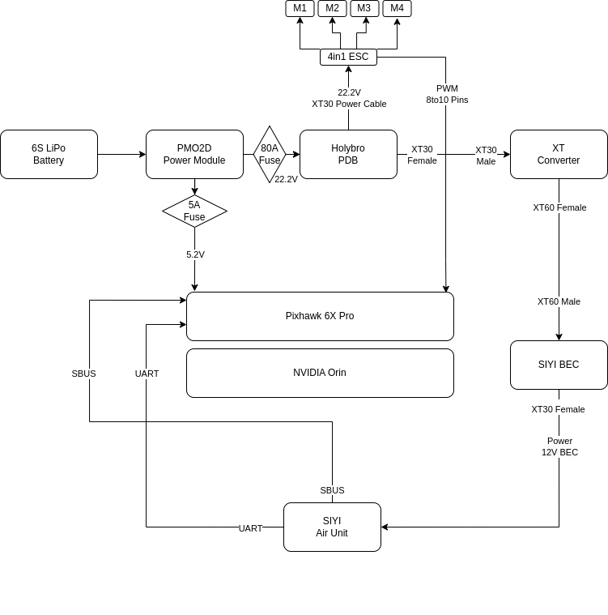

(barebone-hardware)=
# Hardware

The **barebone platform** is the starting point of MAVISS development.  
It is a minimal configuration that supports **stable GPS-based flight** without perception sensors or NVIDIA Jetson integration.  
This stage is essential for validating the propulsion system, flight controller, and ground station setup.

**Components:**
- **Frame**: Basic quadcopter frame supporting 7-inch propellers  
- **Propulsion**:  
  - NEEBRC 2806.5 Brushless Motors (1300KV)  
  - HQProp 7x4x3 Propellers  
- **Flight Controller**: Holybro Pixhawk 6X Pro  
- **Power System**:  
  - 6S LiPo Battery  
  - PM02D Power Module  
  - Holybro Power Distribution Board (PDB)  
- **GPS**: Holybro H-RTK F9P GNSS  
- **Ground Station**: SIYI MK32 Smart Controller  
- **Firmware**: PX4 Autopilot with QGroundControl for setup  

---

## 3D Prints / Body Frame

The MAVISS platform uses **custom 3D-printed and modular carbon fiber body components**.  
The design ensures space for mounting companion computers, LiDARs, cameras, and expansion boards.

- **Top Plate**: for mounting Pixhawk, Jetson Orin NX, and power distribution  
- **Middle Frame**: vibration-isolated section for LiDAR and camera payloads  
- **Landing Gear**: tall legs designed to keep sensors elevated from the ground  
- **Custom Mounts**:  
  - SIYI A8 Mini Gimbal Mount  
  - Livox Mid-360 LiDAR Mount  
  - Side arms for antenna & GPS placement  

**Note**: CAD and STL files for MAVISS 3D prints will be hosted in the [Maviss-Hardware GitHub Repository](https://github.com/cviss-lab/maviss/tree/main/maviss_description).

---

## Electronic Diagrams

The MAVISS wiring integrates **Pixhawk, Jetson Orin NX, GPS, SIYI MK32 and its Air-Unit** into a single modular system.  
The power distribution ensures stable supply to both flight-critical and perception systems.

**Diagram Overview:**
- **Pixhawk 6X Pro**: connected to Jetson via UART (MAVLink), SBUS for RC, and GPS input  
- **Jetson Orin NX**: powered by XT converter with 12V BEC, handling LiDAR & perception stack  
- **SIYI Air Unit & MK32**: UART + SBUS control, powered through dedicated 12V BEC    

---

## Drone Assembly

The assembly process combines the barebone structure, 3D-printed mounts, and wiring harness into the final MAVISS drone.

**Steps:**
1. Assemble frame and mount propulsion system (motors + propellers).  
2. Install Pixhawk 6X with vibration isolation.  
3. Mount GPS on elevated mast for clear satellite visibility.  
4. Add custom 3D-printed mounts for Jetson, LiDAR, and SIYI Gimbal.  
5. Connect electronic wiring per schematic.  
6. Calibrate sensors (accelerometer, magnetometer, GPS, radio) via QGC.  
7. Perform tethered test flight to validate stability.  

**Result:**  
A fully assembled MAVISS drone ready for further integration of autonomy and perception systems.

